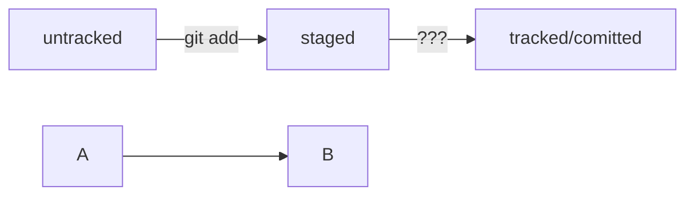

## Практическая работа №1. «Делимся проектом с миром»
------

### Работа с Git
* Показывает информацию о состоянии репозитория
```sh
git status
```
* Инициализация локального репозитория
```sh
git init
```
* Добавление индексирования файлов текущего каталога (выполняется перед коммитом)
```sh
git add .
```
* Добавление слепка состояния файлов (коммита) с комментарием
```sh
git commit -m "Комментарий"
```
* Добавление слепка состояния файлов (коммита) с комментарием
```sh
git commit -m "Комментарий"
```
* Добавление всех коммитов локальной ветки на удаленную (перед этим необходимо выполнить найстройку удаленного репозитория)
```sh
git push
```
### Работа с GitHub
* Привязка удалённого репозитория к локальному
```sh
git remote add origin git@github.com:%ИМЯ_АККАУНТА%/%ИМЯ_ПРОЕКТА%.git
```
* Проверка привязки удалённого репозитория к локальному
```sh
git remote -v
```
* Первая отправка коммитов на удалённый репозиторий (далее просто **git push**)
```sh
git push -u origin master
```

## Дополнение практической работы №1. «Делимся проектом с миром»
------

* Отображение схем через mermaid



* Дополнить последний коммит новыми данными
```sh
git commit --amend --no-edit
```

* Дополнить последний коммит новыми данными с новым комментарием
```sh
git commit --amend -m "Обновлённое сообщение коммита"
```

## Обновление 05.11.2023

*  Вывести историю коммитов
```sh
git log
```

*  Получить сокращённый лог коммитов
```sh
git log --oneline
```

*  Файл HEAD (англ. «голова», «головной»)
```sh
Один из служебных файлов папки .git. Он указывает на коммит, который сделан последним (то есть на самый новый).
```
*  Статусы 'untracked/tracked, staged и modified'
 - untracked (англ. «неотслеживаемый»).  У untracked-файла нет предыдущих версий, зафиксированных в коммитах или через команду git add.
 - staged (англ. «подготовленный»).  После выполнения команды git add файл попадает в staging area (от англ. stage — «сцена», «этап [процесса]» и area — «область»), то есть в список файлов, которые войдут в коммит. В этот момент файл находится в состоянии staged.
 - tracked (англ. «отслеживаемый»).  Состояние tracked — это противоположность untracked. Оно довольно широкое по смыслу: в него попадают файлы, которые уже были зафиксированы с помощью git commit, а также файлы, которые были добавлены в staging area командой git add. То есть все файлы, в которых Git так или иначе отслеживает изменения.
 - modified (англ. «изменённый»).  Состояние modified означает, что Git сравнил содержимое файла с последней сохранённой версией и нашёл отличия. Например, файл был закоммичен и после этого изменён.

*  Cостояния показывает git status
```sh
Большинство файлов в типичном проекте будут находиться в состоянии tracked (то есть закоммичены и не изменены после коммита). 
Вы не увидите это состояние в выводе команды git status — иначе она бы каждый раз выводила список вообще всех файлов проекта.
В итоге git status показывает только следующие состояния файлов:
staged (Changes to be committed в выводе git status);
modified (Changes not staged for commit);
untracked (Untracked files).
```

*  Исправить (обновить) последний коммит
```sh
git commit --amend --no-edit
```

*  Исправить (обновить) последний коммит с заменой его сообщения
```sh
git commit --amend -m "Текст нового сообщения коммита"
```

*  Убрать файл из staging 
```sh
git restore --staged <file>
```

*  «Откатить» коммит (что уже было закоммичено), то есть вернуть состояние репозитория к более раннему. 
```sh
git reset --hard <commit hash>
```

*  «Откатить» изменения, которые не попали ни в staging, ни в коммит
```sh
git restore <file> 
```

*  Просмотреть изменения в файлах. Команда сравнит последнюю закоммиченную версию файлов с текущей (изменённой) версией.
```sh
git diff
```

*  Просмотреть изменения в файлах. Команда сравнит последнюю закоммиченную версию файлов с текущей (изменённой) версией.
```sh
git diff

Команда git diff --staged покажет изменения в staged-файлах относительно последних закоммиченных версий.
```

*  Просмотреть изменения в комминтах.
```sh
git diff A B

По сути команда git diff A B выводит список инструкций: как превратить состояние A в состояние B. 
Если поменять A и B местами (git diff B A), то и инструкции будут обратные: как превратить B в A. 
При этом все зелёные строки станут красными, и наоборот.
```

## Расположение
 [Репозиторий GitHub дайнной справки https://github.com/knyazkovp/HW1](https://github.com/knyazkovp/HW1) 
