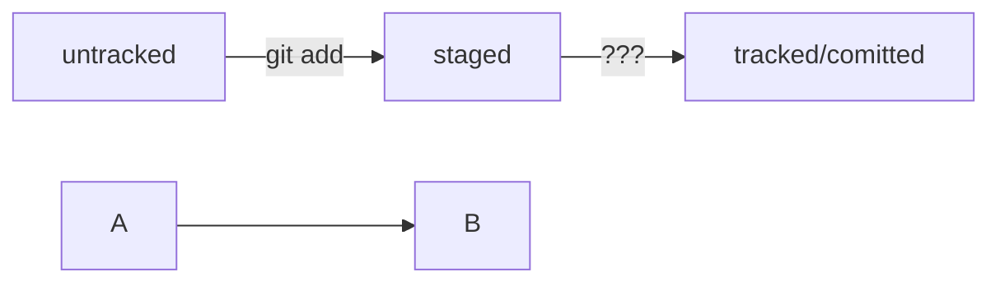

## Практическая работа №1. «Делимся проектом с миром»
------

### Работа с Git
* Показывает информацию о состоянии репозитория
```sh
git status
```
* Инициализация локального репозитория
```sh
git init
```
* Добавление индексирования файлов текущего каталога (выполняется перед коммитом)
```sh
git add .
```
* Добавление слепка состояния файлов (коммита) с комментарием
```sh
git commit -m "Комментарий"
```
* Добавление слепка состояния файлов (коммита) с комментарием
```sh
git commit -m "Комментарий"
```
* Добавление всех коммитов локальной ветки на удаленную (перед этим необходимо выполнить найстройку удаленного репозитория)
```sh
git push
```
### Работа с GitHub
* Привязка удалённого репозитория к локальному
```sh
git remote add origin git@github.com:%ИМЯ_АККАУНТА%/%ИМЯ_ПРОЕКТА%.git
```
* Проверка привязки удалённого репозитория к локальному
```sh
git remote -v
```
* Первая отправка коммитов на удалённый репозиторий (далее просто **git push**)
```sh
git push -u origin master
```

## Дополнение практической работы №1. «Делимся проектом с миром»
------



## Расположение
 [Репозиторий GitHub дайнной справки https://github.com/knyazkovp/HW1](https://github.com/knyazkovp/HW1) 
